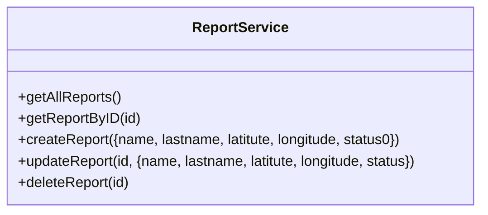
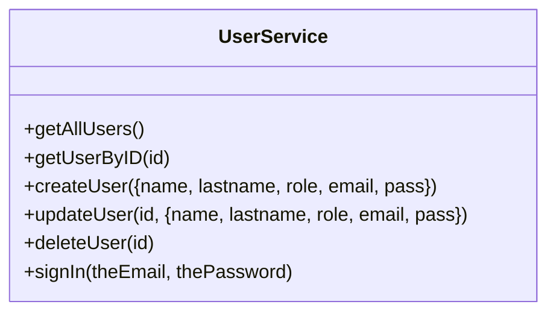
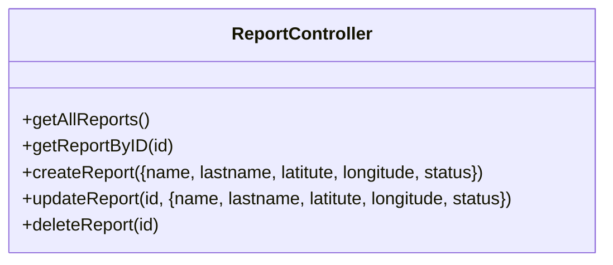
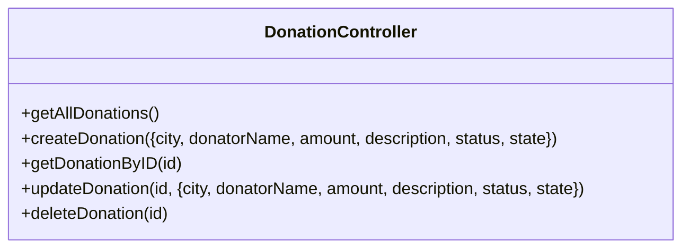
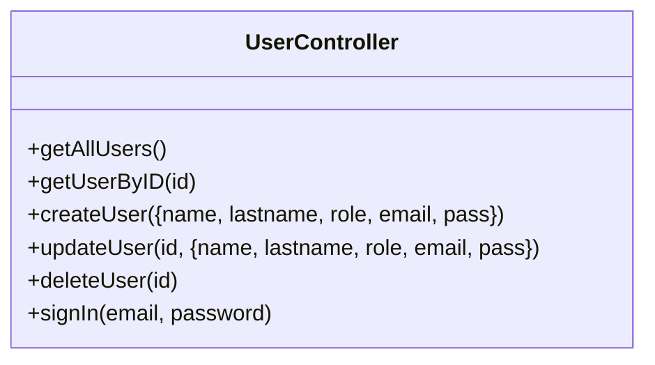

# HackTheOcean

## Services

## Controllers

## Models
### Reports
| Campo | Tipo de Dato |
|---|---|
| id | Integer (autogenerado) |
| latitude | String |
| longitude | String |
| name | String |
| lastname | String |
| status | String |
| dateCreated | DateTime (autogenerado) |
| lastUpdated | DateTime (autogenerado) |

### Donations
| Campo | Tipo de Dato |
|---|---|
| id | Integer (autogenerado) |
| city | String |
| donatorName | String |
| amount | Decimal |
| description | String |
| status | String |
| state | String |
| dateCreated | DateTime (autogenerado) |
| lastUpdated | DateTime (autogenerado) |

### Users
| Campo | Tipo de Dato |
|---|---|
| id | Integer (autogenerado) |
| name | String |
| lastname | String |
| email | String |
| role | Integer |
| pass | String |
